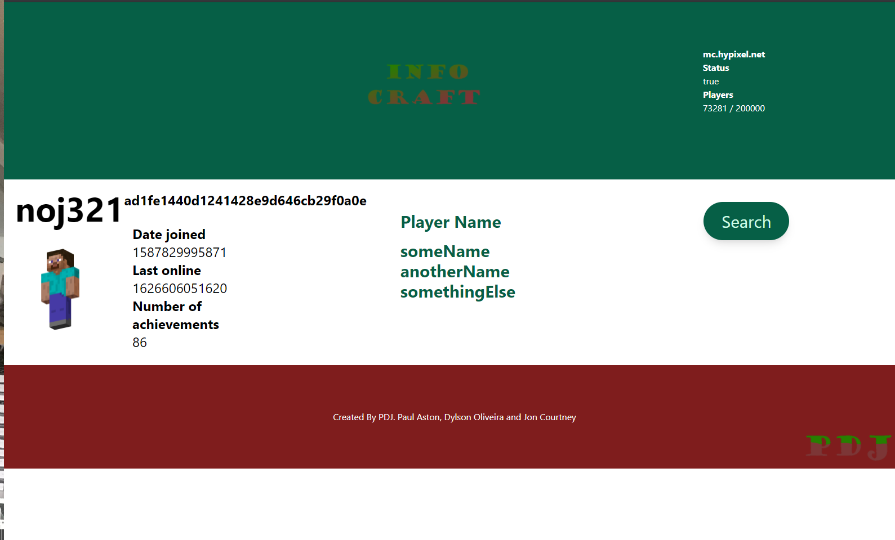

# INFOCRAFT

Infocraft is a Minecraft data app that allows people to search their game data, such as number of achievements, when they joined and last they was online. It also shows data of the Hypixel server telling the user how many players are currently online. This was a project made with HTML, Tailwind and Javascript using two API's and making them work togethor beatifully. This was also a project for University of Birmingham Bootcamp.

## Project 1 Overview

You and your group will use everything you’ve learned over the past six units to create a real-world front-end application that you’ll be able to showcase to potential employers. The user story and acceptance criteria will depend on the project that you create, but your project must fulfil the following requirements:

## Application Requirements

* Use a CSS framework other than Bootstrap.
* Be deployed to GitHub Pages.
* Be interactive (i.e., accept and respond to user input).
* Use at least two [server-side APIs](https://coding-boot-camp.github.io/full-stack/apis/api-resources).
* Does not use alerts, confirms, or prompts (use modals).
* Use client-side storage to store persistent data.
* Be responsive.
* Have a polished UI.
* Have a clean repository that meets quality coding standards (file structure, naming conventions, follows best practices for class/id naming conventions, indentation, quality comments, etc.).
* Have a quality README (with unique name, description, technologies used, screenshot, and link to deployed application).

## The Two API's

Hypixel- An Api to get server data
ServerStatus- An API to get player personal data

## The Creators:

Paul- 
Dylson-
Jon-

## Challenges:

Had to change our original idea as had security issues with the API, originally wanted to do a text translator.

## Successes:

We had great fun working as a team.

## Overall

We have made a really good app in such a short time considering it was our first time working together. It has a lot of scalibility and as such a popular game im sure many people will find it useful.

## Links to Project:

https://jjcourtney.github.io/PDJ/
https://github.com/jjcourtney/PDJ

## Powerpoint Presentation Link:

